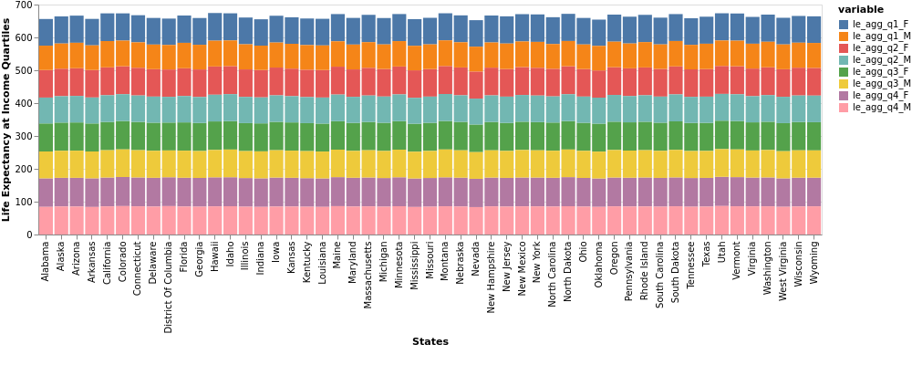

# Social Mobility: Looking at the effect of Income on Life Expectancy 

## Project Goals

### Describe the question that you are enabling a user to answer. The question should be compelling and the solution should be focused on helping users achieve their goals. 
Essentially, we set out to find out the relationship between some social indicators and how they affect each other. We looked at life expectancy in the United States states as a consequence of the income distribution. 
1. We set out to investigate the male life expectancy in all states
2. We set out to investigate the female life expectancy in all states
3. We set out to investigate the life expectancy as a time series between 2001 and 2014 across all states in the United States

## Design

### How did you choose your particular visual encodings and interaction techniques? What alternatives did you consider and how did you arrive at your ultimate choices?

We settled on using mostly bar charts for our project and this largely came about after we realised that the data we had contained very little variance and as such any other visualization would not easily convey our findings. We used a combination of stacked bar charts and single column bar charts. The stacked charts portray the different income quartiles for bothe genders and we feel it renders them beautifully.

We also used a map to display a heatmap-like visualization for the life expectancies for all states.

## Development

### Describe how the work was split among the team members. Include a commentary on the development process, including answers to the following questions: Roughly how much time did you spend developing your application (in people-hours)? What aspects took the most time?

Working together as a team, I believe was easy. The biggest challenge that would have been was communication as one member is in Kigali while the other is in Pittsburgh but we effectively utilised Zoom and emails to synchronise our thoughts and get work done. 

To break down the process: 
Akintayo Jabar - Created the repository; Led meetings and documentations; Contributed to project code
Michael Finch - Came up with the agreed research question, conceptualized the manner of approach and provided good feedback; Contributed to project code.

Man-hours spent: 25 hours (Akintayo Jabar); ... (Michael Finch)

## Success Story

### Describe an insight or discovery you gain with your application that relates to the goals of your project.
We came to find that generally, across the United States, the life expectancy is higher for women. We also found that the life expectancy is also highest for the population earning in the 4th percentile of their income bracket. I think this is a very logical trend because as with the typical world bank indicators studies, we find that generally, when people earn more, they tend to have a better quality of life which can be linked to improved health and ultimately, a higher life expectancy. Also, as generally, men tend to take on more tedious roles in society - heavy lifting and highly demanding blue-collar jobs, it is almost of no surprise that the life expectancy for men is lower than that of women across all income quartiles. 

Also, it is very worthy to note that analysing data at the States level is not the best as we found, rather harshly that due to the very small amount of data observed at the state level, meaningful insights or trends or seasonality are hard to come by and as such, some measures to be taken when faced with a similar scenario would be getting more data,, preferably at County level for greater observations or merging the data at state level with some other indicators so that at the very least, the dimensionality of exploratory analysis is greater than the initial data received.
